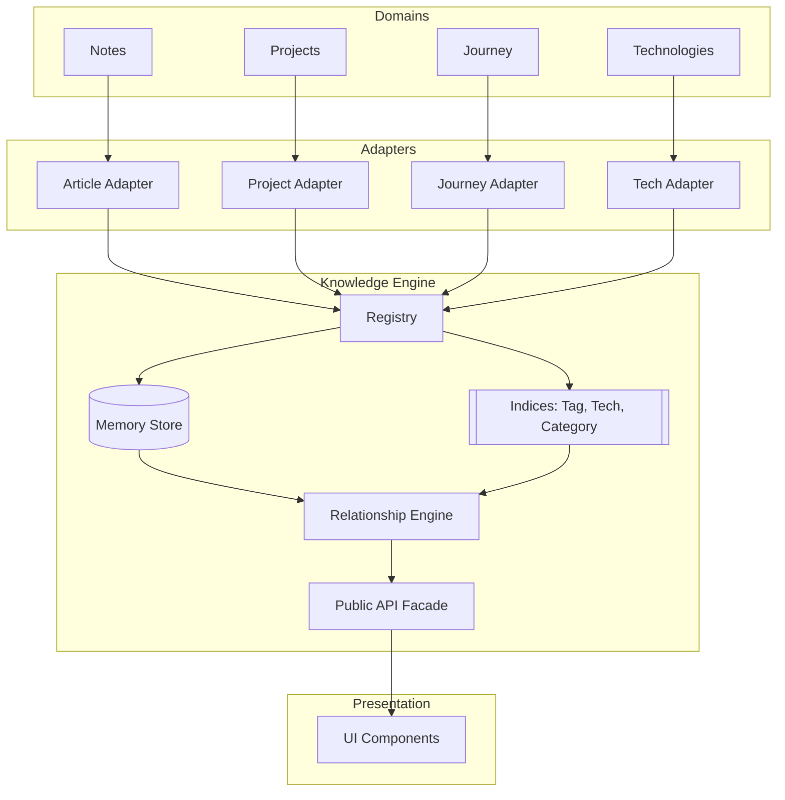

# Knowledge Architecture

## Executive Summary

The Knowledge Platform is the foundational relationship infrastructure that transforms this portfolio from a collection of isolated static pages into a connected, searchable, and discoverable knowledge ecosystem. 

As a portfolio scales, manually curating links between related projects, engineering notes, and timeline events becomes a significant maintenance burden. Links rot, relationships are missed, and the architecture becomes tightly coupled. To solve this, the Knowledge Platform treats discovery as an indexing and intersection problem rather than a manual linking problem. 

The design philosophy prioritizes decoupling, strict type safety, and scalability. Domain objects (like `EngineeringArticle` or `ProjectCaseStudy`) are completely unaware of the knowledge engine. Instead, they are passed through adapters to become normalized `KnowledgeEntity` objects, which are registered into a central memory store. A relationship engine then dynamically computes relationships based on metadata intersections (e.g., shared tags, technologies, and categories). 

By building this as reusable infrastructure rather than a single-use feature, the system can gracefully support years of evolving content without requiring architectural rewrites.

---

## Table of Contents

- [Executive Summary](#executive-summary)
- [Architecture Decision Records](#architecture-decision-records)
- [High Level Goals](#high-level-goals)
- [Architectural Principles](#architectural-principles)
- [Non-Goals](#non-goals)
- [System Overview](#system-overview)
- [Folder Structure](#folder-structure)
- [Knowledge Entity Model](#knowledge-entity-model)
- [Domain Adapters](#domain-adapters)
- [Registry](#registry)
- [Memory Store](#memory-store)
- [Indexing Strategy](#indexing-strategy)
- [Relationship Engine](#relationship-engine)
- [Explainable Relationships](#explainable-relationships)
- [Public API](#public-api)
- [UI Layer](#ui-layer)
- [Performance Considerations](#performance-considerations)
- [Type Safety](#type-safety)
- [Extending the System](#extending-the-system)
- [Example Lifecycle](#example-lifecycle)
- [Future Evolution](#future-evolution)
- [Engineering Lessons](#engineering-lessons)
- [Glossary](#glossary)
- [Conclusion](#conclusion)

---

## Architecture Decision Records

### ADR-001: Adapter Pattern instead of Inheritance
- **Decision**: Domain objects (e.g., `EngineeringArticle`, `Project`) do not extend a base `KnowledgeEntity` interface. Instead, they are mapped to `KnowledgeEntity` objects via pure functions (Adapters).
- **Motivation**: To prevent the Knowledge Engine from dictating the shape of domain data, ensuring strong separation of concerns.
- **Alternatives Considered**: Having all content schemas extend a single base interface.
- **Trade-offs**: Requires writing boilerplate mapping code.
- **Why it was chosen**: Forcing inheritance tightly couples domains. If the Knowledge Engine requires a new field, every domain object breaks. Adapters isolate this churn.

### ADR-002: Registry Pattern instead of Direct Imports
- **Decision**: The Knowledge Engine does not directly import domain datasets (like `platformArticles`). Instead, the application registers adapted entities into the engine's memory store on initialization.
- **Motivation**: To prevent massive dependency graphs and circular imports.
- **Alternatives Considered**: The engine importing content arrays directly.
- **Trade-offs**: Requires an explicit initialization step during application boot.
- **Why it was chosen**: It reverses the dependency direction. The engine becomes purely agnostic infrastructure that simply accepts what it is given.

### ADR-003: Computed Relationships instead of Manual Links
- **Decision**: Relationships are determined at runtime by calculating metadata intersections (shared tags, tech, etc.) rather than relying on `relatedEntityIds` arrays.
- **Motivation**: Hardcoded relationships rot over time and become a massive maintenance burden as a portfolio scales.
- **Alternatives Considered**: Allowing authors to manually specify related entity IDs in Markdown/TypeScript.
- **Trade-offs**: Slightly increased runtime processing cost to compute intersections. Loss of precise, manual curation.
- **Why it was chosen**: Computed relationships scale infinitely. If manual overrides are ever strictly required, they can be added to the scoring algorithm as a high-priority weight later.

### ADR-004: Normalized Knowledge Entity
- **Decision**: The engine stores a flat, fully-typed `KnowledgeEntity` projection designed specifically for indexing and discovery, and discards the `raw` domain object.
- **Motivation**: To ensure absolute type safety and minimize memory footprint.
- **Alternatives Considered**: Including a `raw: unknown` property on the entity to allow UIs to cast back to the original domain object.
- **Trade-offs**: UIs rendering Knowledge Cards only have access to normalized presentation metadata, not domain-specific deep fields.
- **Why it was chosen**: Relying on `unknown` types is an anti-pattern. If a feature needs the full original domain object, it should query its respective domain service using the slug parsed from the entity's URN.

### ADR-005: Framework-Agnostic Knowledge Engine
- **Decision**: The core knowledge engine (`src/lib/knowledge/`) contains zero React code.
- **Motivation**: To cleanly separate business logic from presentation.
- **Alternatives Considered**: Exposing custom React Hooks (e.g., `useRelatedEntities`) directly from the engine module.
- **Trade-offs**: UI components must wire up the functional API themselves.
- **Why it was chosen**: It keeps the engine pure, easily testable, and highly reusable, allowing the presentation layer (`src/components/knowledge/`) to remain purely stylistic.

---

## High Level Goals

1. **Metadata-First Architecture**: Relationships must be inferred through shared characteristics (tags, technologies, categories, series) rather than manual edge mapping. This allows the graph to grow automatically as new content is added.
2. **Separation of Concerns**: Domain data, storage, indexing, relationship calculation, and UI presentation must be strictly isolated into single-responsibility modules.
3. **Reusable Infrastructure**: The engine must be entity-agnostic. It should handle a project identically to how it handles an engineering note.
4. **Strong Typing**: The system must enforce strict compile-time guarantees, entirely avoiding `any` or `unknown` types.
5. **Explainable Relationships**: The engine must not only calculate that two entities are related, but *why* they are related, providing the UI with context (e.g., "Also uses React").
6. **Automatic Discovery**: Creating a new file in a content directory should instantly wire it into the global relationship graph.
7. **Performance & Scalability**: The engine must compute complex intersections efficiently using optimized memory indices, scaling effortlessly as the dataset grows.

---

## Architectural Principles

- **Metadata First**: By relying on metadata rather than manual edge declarations, the system becomes self-organizing.
- **Adapter Pattern over Inheritance**: Normalization is achieved at runtime, preventing restrictive base-class coupling.
- **Registry Pattern**: Inversion of control ensures the engine remains unaware of how domain data is stored or fetched.
- **Single Responsibility Principle**: Every module (Storage, Indexing, Scoring, Rendering) focuses on a singular purpose.
- **Composition over Inheritance**: We build features by composing pure functions and standardized metadata rather than deeply nested class structures.
- **Framework Agnostic Business Logic**: Core algorithms execute independently of the rendering layer.
- **Public API Isolation**: Implementation details are hidden behind a strict module facade.

---

## Non-Goals

To maintain a focused and maintainable architecture, this system explicitly does **NOT** attempt to solve:

- **AI Recommendations**: We are not running LLM embeddings or predictive models to guess user intent.
- **Semantic Embeddings / Vector Search**: Relationships are calculated via exact metadata intersections, not cosine similarity of text embeddings.
- **Graph Visualizations**: The engine provides relationship data, but does not render interactive D3/Canvas node graphs.
- **External Databases**: This is a client-side architecture; we are not connecting to Neo4j or PostgreSQL.
- **Distributed Systems / Runtime Persistence**: We do not synchronize relationship states across sessions or devices.
- **Machine Learning Ranking**: Scoring is deterministic and weighted mathematically, not trained via user behavior.

These constraints ensure the system remains a lightweight, reliable architectural foundation.

---

## System Overview

The Knowledge Platform operates through a unidirectional data flow:



1. **Domains** hold the raw data (Notes, Projects, Journeys, Technologies).
2. **Adapters** normalize that data into a uniform `KnowledgeEntity`.
3. **Registry** ingests the normalized data on load.
4. **Store & Indices** hold the data in memory and build rapid-lookup tables.
5. **Relationship Engine** executes intersection mathematics against the store.
6. **Public API** exposes functional query methods.
7. **React Components** render the results.

---

## Folder Structure

The implementation resides primarily in `src/lib/knowledge/` and `src/components/knowledge/`.

```text
src/
├── components/
│   └── knowledge/          # React UI components (Cards, Grids, Meta badges)
└── lib/
    └── knowledge/
        ├── index.ts        # The strict Public API facade
        ├── registry.ts     # Initialization and ingestion logic
        ├── api.ts          # Functional discovery and retrieval methods
        ├── core/
        │   └── types.ts    # URNs, KnowledgeEntity, RelationshipMatch
        ├── adapters/
        │   ├── articleAdapter.ts  # Maps ArticleMetadata -> KnowledgeEntity
        │   └── projectAdapter.ts  # Maps ProjectData -> KnowledgeEntity
        ├── store/
        │   ├── memoryStore.ts   # In-memory entity storage
        │   └── indexer.ts       # Optimized lookup indices (Tag, Tech, Category)
        └── engine/
            ├── intersection.ts  # Pure functions for metadata overlap calculation
            └── scoring.ts       # Weighted ranking algorithms
```

This structure strictly enforces boundaries. The `engine` never imports `components`. The `adapters` never import `engine`. 

---

## Knowledge Entity Model

To compute relationships efficiently, the engine requires a predictable data shape.

```typescript
export interface KnowledgeEntity {
  schemaVersion: "1.0.0";
  urn: EntityUrn;
  type: KnowledgeEntityType;
  slug: string;
  title: string;
  description: string;
  url: string;
  tags: readonly string[];
  technologies: readonly string[];
  categories: readonly string[];
  // ... presentation metadata (date, difficulty, readingTime)
}
```

- **EntityUrn**: A globally unique identifier (e.g., `urn:article:spa-router`). This prevents ID collisions if a project and an article happen to share the same slug.
- **Normalized Schema**: The model contains exactly what is needed for indexing, relationship scoring, and basic UI card rendering. It does *not* contain heavy payloads like article content or project roadmaps. 
- **Schema Version**: Allows for future backwards-compatible evolution of the entity structure.

Domain models remain independent because an `EngineeringArticle` has wildly different requirements than a `ProjectCaseStudy`. The normalized model acts as a highly optimized, read-only projection of the domain.

---

## Domain Adapters

The Adapter Pattern acts as the bridge between isolated domains and the unified Knowledge Engine.

Instead of modifying `ArticleMetadata` to fit the engine, we write a pure function:
`articleToKnowledgeEntity(article: EngineeringArticle): KnowledgeEntity`

### Why Adapters?
Forcing inheritance (e.g., `interface Article extends KnowledgeEntity`) tightly couples the domains. Adapters isolate churn. The domain can evolve freely; only the mapping function needs to be updated.

---

## Registry

The Registry (`registry.ts`) is the ingestion point for the system.

During application initialization (e.g., inside `App.tsx`), the registry is invoked once. It imports the raw domain datasets, maps them through their respective adapters, and registers them with the Memory Store.

### Why a Registry?
If the Knowledge Engine directly imported `platformArticles` and `projects`, the engine would become bloated and tightly coupled to the content layers. The Registry reverses the dependency: the engine simply accepts what it is given.

---

## Memory Store

The `MemoryStore` is a singleton class responsible for holding the normalized `KnowledgeEntity` objects at runtime.

- **Storage**: A `Map<EntityUrn, KnowledgeEntity>` providing rapid access to any entity by its global ID.
- **Indices**: A `Map<KnowledgeEntityType, Set<EntityUrn>>` providing rapid access to all entities of a specific type.
- **Lifecycle**: It is populated once on load and remains entirely static, making it highly memory-efficient and predictable.

---

## Indexing Strategy

To prevent unnecessary iteration during relationship calculations, the `KnowledgeIndexer` builds inverted indices during registration.

- **Tag Index**: `Map<string, Set<EntityUrn>>`
- **Tech Index**: `Map<string, Set<EntityUrn>>`
- **Category Index**: `Map<string, Set<EntityUrn>>`
- **Series & Project Indices**: For hierarchical mapping.

If a user requests "All entities using React", the system simply looks up `"react"` in the Tech Index and retrieves the `Set` of URNs instantly.

---

## Relationship Engine

The engine computes the relevance between a source entity and all other entities in the store.

1. **Filtering**: Excludes the source entity (no self-references) and filters by allowed target types.
2. **Intersection**: `calculateIntersection` computes the overlap in `tags`, `technologies`, `categories`, `series`, and `projects`.
3. **Scoring**: A weighted algorithm ranks the match.
   - Same Project: +6
   - Same Series: +5
   - Shared Technology: +4 per match
   - Shared Tag: +3 per match
   - Shared Category: +2 per match
   - Same Difficulty: +1
4. **Tie-breaking**: Sorts descending by score, falling back to an alphabetical sort on the title to guarantee deterministic rendering.
5. **Truncation**: Applies the requested `limit`.

---

## Explainable Relationships

Instead of merely returning `[entityA, entityB]`, the engine returns an array of `RelationshipMatch` objects.

```typescript
export interface RelationshipMatch {
  entity: KnowledgeEntity;
  score: number;
  reasons: {
    sharedTechnologies: string[];
    sharedTags: string[];
    sharedCategories: string[];
  };
}
```

### Why Explainability?
A score of `12` is meaningless to a user. By returning the `reasons`, the UI can confidently render badges on related cards stating: *"Related because both use TypeScript and React"*. This vastly improves the UX of discovery features.

---

## Public API

The entire subsystem is hidden behind a strict facade pattern in `src/lib/knowledge/index.ts`.

Consumers are only allowed to import functional execution methods:
- `getEntity(urn)`
- `discoverRelated(urn, config)`
- `getEntitiesByType(type)`

### Why a Strict Facade?
If UI components import the `memoryStore` directly, refactoring the storage layer (e.g., migrating to an external database) would break the entire application. The facade guarantees that implementation details can change without affecting consumers.

---

## UI Layer

React components live in `src/components/knowledge/` and are strictly presentational.

- **`KnowledgeGrid`**: A responsive container handling layout.
- **`KnowledgeCard`**: A polymorphic presentation card. It accepts a `KnowledgeEntity` and renders consistently regardless of whether the entity is a Project or an Article.
- **`KnowledgeMeta`**: Renders unified metadata pills (reading time, difficulty, category).

By keeping business logic out of the UI, the components remain pure, testable, and highly reusable.

---

## Performance Considerations

- **Initialization Cost**: Mapping and indexing entities happens once on application load, ensuring the system is ready immediately without incurring costs mid-scroll.
- **Immutable Operations**: The relationship engine relies on pure functions and strict `Set` intersections, ensuring the calculation pipeline remains highly optimized.
- **Memory Footprint**: Normalization strips heavy payload data (like rich text content). The lightweight in-memory representation is expected to perform extremely well even as the dataset grows over time.

---

## Type Safety

The architecture relies heavily on TypeScript's advanced features to guarantee runtime stability.

- **Strict Types**: Eliminating `any`, `unknown`, and unsafe type assertions (`as unknown as X`).
- **Discriminated Unions**: `KnowledgeEntityType` ensures exhaustiveness checks in switch statements.
- **URNs**: `EntityUrn` uses Template Literal Types (`urn:${KnowledgeEntityType}:${string}`) so a generic string cannot accidentally be passed into a URN parameter.

---

## Extending the System

To add a completely new entity type (e.g., `Talk`):

1. **Add Type**: Add `"talk"` to `KnowledgeEntityType` in `core/types.ts`.
2. **Create Adapter**: Write `talkToKnowledgeEntity(talk: Talk): KnowledgeEntity`.
3. **Register**: Add the mapping loop to `registry.ts`.
4. *(Optional)* **Update UI**: If `"talk"` requires a unique icon in the `KnowledgeCard`, add a switch case.

The relationship engine, storage, and indices require absolutely zero changes. The new `Talk` entities will immediately begin appearing in discovery sections across the site.

---

## Example Lifecycle

Let's trace what happens when we calculate relationships for the MEDROUTER Project.

1. **Initialization**: The application boots. `initializeKnowledgeRegistry()` fires.
2. **Adaptation**: `medrouterProject` is passed through `projectToKnowledgeEntity`, returning a normalized `KnowledgeEntity`.
3. **Registration**: The entity is saved in the `MemoryStore`. Its technologies (`["React", "TypeScript"]`) are added to the `techIndex`.
4. **Query**: A component calls `discoverRelated('urn:project:medrouter')`.
5. **Engine Execution**: The engine loops through all other entities in the store, calculating intersections. It finds an Article tagged with "TypeScript".
6. **Scoring**: The engine calculates a score based on the shared technology (+4).
7. **Return**: The engine returns a `RelationshipMatch` array including the reasons.
8. **Render**: The UI passes the match into a `<KnowledgeCard />`, which displays the Article as related reading.

---

## Future Evolution

This architecture acts as the foundation for future discovery capabilities. Because relationships are computed globally and metadata is standardized, the following features can be layered on without fundamental architectural changes:

### Technology Hubs (Implemented via FP9C.3)
Technologies themselves are elevated to first-class `KnowledgeEntity` objects within the Knowledge Engine. Rather than treating technologies simply as string tags, they have their own rich metadata (descriptions, URLs, categories). 
When a user navigates to a Technology Hub (e.g. `/technology/react`), the `TechnologyHubPage` consumes the *generic* `discoverForEntity('urn:technology:react')` API from the Discovery Service. The Knowledge Engine then dynamically calculates and returns all related Projects, Articles, Journey Entries, and sibling Technologies based on metadata overlap. This completely generic integration proves the robustness of the core architecture: the Discovery Service doesn't need to know anything specific about "Technologies"—it simply orchestrates the Knowledge Engine.

### Upcoming Evolutions

- **Continue Learning**: Suggesting the next logical article based on difficulty and series indices.
- **Cross-Project Discovery**: Surfacing articles directly within project case studies based on architectural overlaps.
- **Semantic Search**: Integrating hybrid search where exact metadata intersects with vector embeddings for deeper discovery.
- **Server-Side Registry**: Moving the memory store to a backend service without changing the frontend Public API facade.

---

## Engineering Lessons

Building the Knowledge Platform surfaced several critical lessons about architectural design:

- **Premature abstraction is dangerous, but delayed abstraction is fatal.** We waited until the platform had Articles, Projects, and Journey entries before building this engine. If we had built it earlier, we would have guessed the requirements wrong. Waiting provided the exact constraints needed to design the right abstractions.
- **Metadata-First Design scales infinitely.** Hardcoding connections is intuitive for the first 10 articles but becomes impossible to maintain at 100. By shifting the burden from manual curation to computed metadata intersections, the system organizes itself.
- **Separation of Concerns enables developer velocity.** Because the relationship engine contains zero React code and the UI contains zero scoring logic, debugging is trivial. You never wonder *where* a bug lives.
- **Type-Driven Design prevents logical errors.** Enforcing the `EntityUrn` template literal type immediately highlighted areas where we were passing raw slugs instead of global IDs, preventing subtle bugs before they reached runtime.
- **Explainable Systems build trust.** A black-box algorithm returning a score is hard to debug and hard to present. By forcing the engine to return *reasons*, both the developer and the end-user understand exactly why content is surfaced.

---

## Glossary

- **Knowledge Entity**: A normalized, flat projection of a domain object designed strictly for indexing, relationship scoring, and card rendering.
- **Adapter**: A pure function that converts a domain-specific object (like an Article) into a Knowledge Entity.
- **Registry**: The initialization layer that ingests adapted entities into the system.
- **Memory Store**: The centralized, in-memory repository holding all registered Knowledge Entities.
- **Index**: An optimized lookup table (e.g., mapping a technology string to a Set of URNs) used to prevent slow iteration.
- **Relationship Engine**: The core algorithm that calculates metadata overlaps and ranks entities by relevance.
- **Metadata**: The structured data (tags, technologies, categories, series) used to describe and connect entities.
- **Normalization**: The process of discarding domain-specific payloads to create a unified, predictable entity shape.
- **Discovery**: The process of querying the engine to surface related, relevant content.
- **URN (Uniform Resource Name)**: A globally unique identifier string format (`urn:type:slug`) preventing collisions across domains.
- **Relationship Match**: An object containing a target entity, its relevance score, and the specific reasons it matched the source.
- **Public API**: The strict module boundary (`index.ts`) that hides internal implementation details from consuming UI components.

---

## Conclusion

The Knowledge Platform is not just a feature; it is the central nervous system of the portfolio. By treating knowledge discovery as an indexing and intersection problem rather than a manual linking problem, the portfolio is now equipped to scale gracefully as a premier engineering publication.